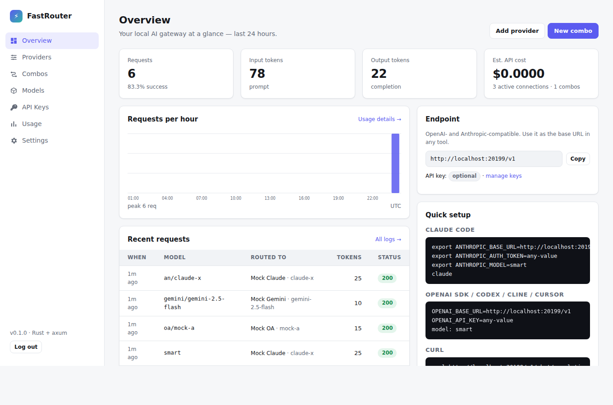

# FastRouter



A local AI gateway written in Rust, modelled on [9router](https://github.com/decolua/9router).
FastRouter gives Claude Code, Codex, Cursor, Cline and any OpenAI or Anthropic SDK client a single endpoint. It routes each request to one of many upstream providers, translates between API formats, falls back automatically when a provider fails, and tracks token usage and estimated cost.

- **Backend:** [axum](https://github.com/tokio-rs/axum) + tokio + reqwest. SQLite (bundled) is used for storage.
- **Dashboard:** rendered on the server by compile-time [maud](https://maud.lambda.xyz) templates. There's no SPA, no build step and no JS framework. Every page is complete HTML before it reaches the browser. A few lines of inline JS power the "Copy" buttons, and everything else works with JS disabled.
- **Single binary:** the CSS is embedded, so you don't need to deploy any assets.

## Features

| | |
|---|---|
| **Client APIs** | OpenAI Chat (`/v1/chat/completions`), Anthropic Messages (`/v1/messages`, `count_tokens`), OpenAI Responses (`/v1/responses`, `/codex/*`, `compact`), Gemini (`/v1beta/models/*:generateContent`/`streamGenerateContent`), Ollama (`/api/chat`, `/api/tags`), `GET /v1/models` |
| **Media APIs** | `/v1/embeddings`, `/v1/images/generations`, `/v1/audio/speech`, `/v1/audio/voices`, `/v1/audio/transcriptions`, `/v1/search`, `/v1/web/fetch`, `/v1/videos/*`, `/v1/systemone` |
| **Providers** | All 129 providers from 9router's registry (API-key, OAuth subscriptions, free and free-tier, web-cookie), plus any number of custom OpenAI-compatible (chat or Responses) and Anthropic-compatible endpoints and custom embedding endpoints |
| **OAuth logins** | Browser (auth-code / PKCE) logins for Claude Code, Codex, xAI, GitLab, Gemini CLI, Antigravity, iFlow, Cline, Zed, Xiaomi MiMo, Kimchi; device-code logins for GitHub Copilot, Kiro (Builder ID, IAM Identity Center, Google/GitHub), Kimi, Kilo Code, CodeBuddy, Qoder, Grok CLI, Muse, GLM; token imports for Cursor, Zed, Codex, Kiro, iFlow. Tokens are refreshed automatically |
| **Format translation** | OpenAI ⇄ Anthropic ⇄ Gemini ⇄ Responses ⇄ Ollama, requests, responses and SSE streams (tools, images, reasoning, usage) |
| **Combos** | Named fallback chains (`premium = cc/claude-sonnet-4-5 → glm/glm-4.6 → openrouter/…`), fallback or round-robin, capability-aware ordering |
| **Multi-account** | Several accounts per provider, fill-first or sticky round-robin, per-model locks with exponential backoff and quota-reset awareness |
| **Usage** | Every attempt is logged with tokens, latency, status and an estimated cost, broken down by model, provider and API key |
| **Auth** | Password-protected dashboard (argon2 + HMAC-signed session cookie); `/v1` API keys optional or required |

## Run

```bash
cargo run --release
# dashboard: http://localhost:20128/dashboard   (default password: 123456)
# endpoint:  http://localhost:20128/v1
```

Or use Docker:

```bash
docker build -t fastrouter .
docker run -p 20128:20128 -v fastrouter-data:/data -e INITIAL_PASSWORD=change-me fastrouter
```

### Environment

| Variable | Default | |
|---|---|---|
| `PORT` | `20128` | |
| `HOST` | `0.0.0.0` | |
| `DATA_DIR` | `~/.fastrouter` | SQLite lives at `$DATA_DIR/db/data.sqlite` |
| `INITIAL_PASSWORD` | `123456` | Only applies on first start. Change it later in Settings |
| `REQUIRE_API_KEY` | (unset) | `true`/`false` overrides the dashboard toggle |
| `RUST_LOG` | `fastrouter=info` | |
| `HTTPS_PROXY` / `HTTP_PROXY` | | Honoured for upstream requests |

### Google OAuth clients

Gemini CLI and Antigravity sign in with Google using those tools' own public OAuth clients. They are not shipped in this repository; set them as environment variables (`GOOGLE_OAUTH_CLIENT_ID`, `GOOGLE_OAUTH_CLIENT_SECRET`, `ANTIGRAVITY_OAUTH_CLIENT_ID`, `ANTIGRAVITY_OAUTH_CLIENT_SECRET`) or under **Settings → Google OAuth clients**.

## Using it

1. Open **Providers** and pick one:
   - **API-key providers:** paste a key (plus any provider-specific fields such as region or account id).
   - **Subscriptions:** click **Sign in**. Browser logins redirect back to `http://localhost:<port>/callback` (Codex uses `localhost:1455`, xAI `127.0.0.1:56121`, as their OAuth clients require). When FastRouter runs on another machine, paste the final redirect URL into the login page instead. Device-code logins show a code and poll until you approve.
   - **Custom endpoint:** "Add OpenAI/Anthropic-compatible endpoint" with a prefix and base URL.
   - **Test** sends a tiny chat request through that exact account.
2. Under **Combos**, create one with a model per line, in fallback order. Under **Models**, add short aliases.
3. Point your tool at FastRouter:

```bash
# Claude Code
export ANTHROPIC_BASE_URL=http://localhost:20128
export ANTHROPIC_AUTH_TOKEN=<fastrouter key, or anything if keys are optional>
export ANTHROPIC_MODEL=premium-coding

# OpenAI-compatible tools (Codex, Cline, Cursor, SDKs…)
export OPENAI_BASE_URL=http://localhost:20128/v1
```

### Model resolution

Same rules as 9router: `prefix/model` (provider id, alias such as `cc`/`gh`/`cx`, or a custom node prefix), combo names, model aliases, and bare model ids inferred to a provider. Within a provider, accounts are tried by priority (or round-robin); a failing account is locked for that model with backoff and the next one is tried. Combos fall through to the next model when every account of one model fails.

## Layout

```
src/
  main.rs        server setup
  registry.rs    data-driven provider registry (data/registry.json)
  exec.rs        generic transport executor; providers/ holds the special ones
  translate/     request/response/stream translators between all formats
  chat/          chat pipeline: model resolution, combos, accounts, streaming, usage
  api/           client-facing HTTP routes (OpenAI, Anthropic, Responses, Gemini, Ollama)
  mediaapi/      embeddings, images, TTS, STT, search, fetch, video
  oauth/         login flows and token refresh
  ui/            server-rendered dashboard (maud) + embedded CSS
  db.rs          SQLite storage
```

## Development

```bash
cargo test     # unit tests + end-to-end tests against a mock upstream
```

## Credits

Provider registry data, translation rules and executor behaviour are ported from [9router](https://github.com/decolua/9router) (MIT).
